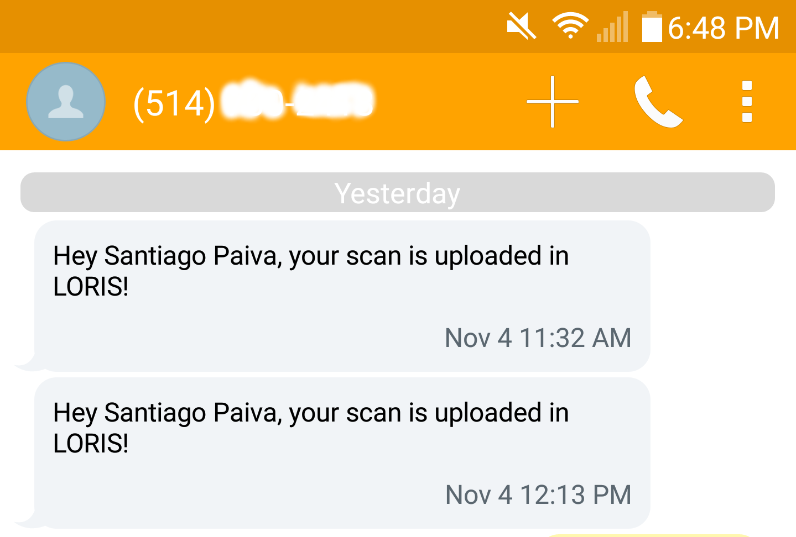

# Twilio for LORIS

Notify researchers via text message that their scan dataset has been uploaded into LORIS.

### Before you begin
---

You need a Twilio account and a purchased number to make this work. Sing up on
https://www.twilio.com/, get a number, and some credits.

### Installation
---

Steps:
1. Install dependencies with `./install.sh`  
2. Populate your environment variables in your `.bashrc` with your Twilio credentials:

     # Twilio Credentials
     export TWILIO_ACCOUNT_SID='your_account_SID'
     export TWILIO_AUTH_TOKEN='your_auth_token'
     export TWILIO_NUMBER='your_twilio_number'  

3. Edit your message in the `body` placeholder of `sendnotifications.php`

### Use
---

Send a sms notification to a user with

     `php sendnotifications.php <username> <user_number>`,

Note that charges will apply to your account credits according to your usage.

### License
---

MIT. 2016.
